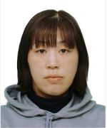

## About

WEBデザインの勉強と高校の学位取得のため働きながら頑張っています。
将来的に、WEBデザインの仕事をしたく、できれば在宅勤務できればと考えています。

## Profile

- Takeda Aya
- 北海道

## History  

1994年4月　　　北海道釧路工業高校　工業化学科　入学 
1995年9月　　　北海道釧路工業高校　工業化学科　中退 
2000年12月   　夫と結婚 
2001年3月　　　普通自動車第一種免許　取得 
2002年～2006年 長女・長男・次男　出産 
2011年　　　　 （旧）ホームヘルパー2級　取得 
2019年　       椎間板ヘルニアで手術する（ホタテの養殖業） 
2020年4月　    転職を考え、高校の学位とWEBデザインやプログラミングの勉強をするため、 
      8月　　　手術後も経過がよくはならず転職（給油スタッフ兼事務） 
2021年4月　　　姉妹校のS高等学校が開校したので転入する 
　　　6月　　　危険物取扱者免状　乙4種　取得 

## Skills   

- Github Pages
- HTML
- CSS
- JavaScript
- Photoshop
- Illustrator
- ZOOM
- Meet

## Works

- ホテルのホールスタッフ
- 大工見習
- ウェートレス
- コンビニ店員
- 飲料水製造員
- プールの監視員
- ホタテの養殖業
- 介護スタッフ
- 現在、給油スタッフ兼事務員

- ［Github］　(https://kurosiba2021.github.io/kuro2021siba.giithub.io/)
- ［PhotoShop］

## contact

- aya_21s1200148@nnn.ed.jp
- r3.020912@gmail.com
           
